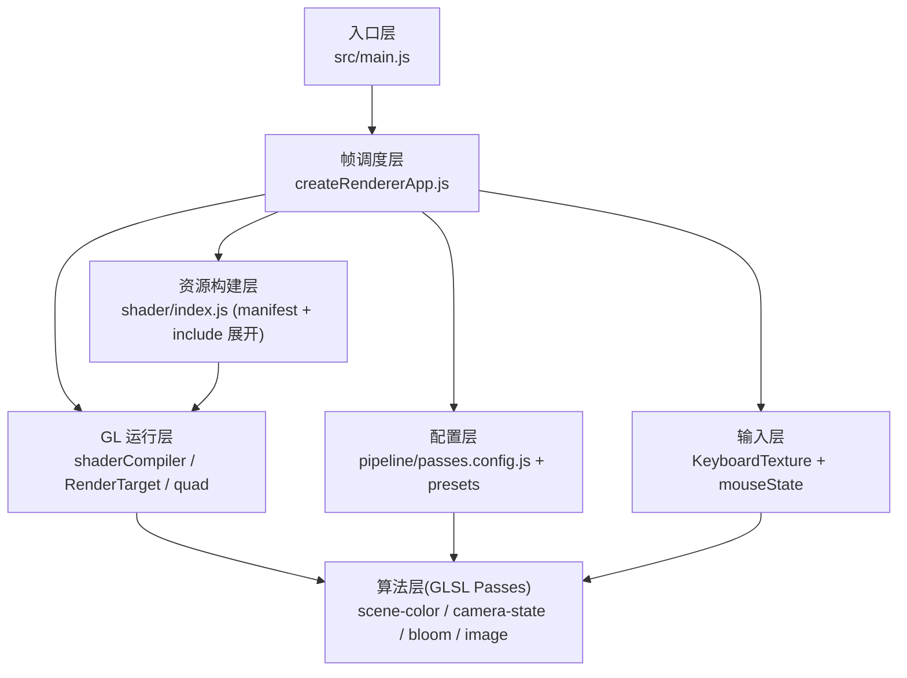

# 01. 架构总览

## 1. 系统目标

该项目是一个基于 `WebGL2 + 多 Pass + ShaderToy 兼容层` 的黑洞可视化渲染器。核心目标：

1. 用多缓冲链路组织复杂效果（场景颜色、相机状态、Bloom、最终合成）。
2. 用统一的 Shader 预处理，把 GLSL 代码写成接近 ShaderToy 的风格。
3. 通过 `iChannel` 纹理通道传递跨 Pass 状态，实现“GPU 内状态机”。

## 2. 顶层目录职责

1. `src/main.js`
   入口，选择 pass preset，创建渲染 App 并启动。
2. `src/app/createRendererApp.js`
   运行时核心：GL 初始化、program 构建、RenderTarget 创建、每帧调度。
3. `src/pipeline/*`
   渲染管线编排（preset 与 pass 执行顺序）。
4. `src/engine/*`
   基础设施层：
   `gl`（编译/预处理/全屏三角形）、`render`（RenderTarget）、`input`（鼠标键盘）、`resize`（视口）。
5. `src/shader/*`
   Shader 清单 + 模块化 GLSL 片段，含 pass 入口与 include 依赖。
6. `scripts/validate-shaders.mjs`
   构建前静态校验：清单合法性、include 完整性、预处理后 `main()` 存在性。

## 3. 分层架构

1. 配置层
   `passes.config.js` + `pipeline/presets/*.js` 决定“跑哪些 pass、顺序是什么、纹理怎么接线”。
2. 资源构建层
   `shader/index.js` 负责 manifest 解析与 `#include` 展开。
3. GL 运行层
   `shaderCompiler.js` / `RenderTarget.js` / `quad.js` 负责 shader program 与离屏目标。
4. 帧调度层
   `createRendererApp.js` 把输入、uniform、channel 绑定、pass 执行串起来。
5. 算法层（GLSL）
   `scene-color`（主光线追踪与物理外观）、`camera-state`（相机状态+金字塔采样）、`bloom`（模糊）、`image`（最终合成）。

### 分层架构图



## 4. Pass 与资源关系（默认 `bloom-chain`）

执行顺序：

1. `scene-color` -> target: `scene-color`（双缓冲）
2. `camera-state` -> target: `camera-state`（双缓冲）
3. `bloom-blur-horizontal` -> target: `bloom-blur-horizontal`（单缓冲）
4. `bloom-blur-vertical` -> target: `bloom-blur-vertical`（单缓冲）
5. `image` -> target: 屏幕默认 framebuffer

关键通道绑定（`channels`）：

1. `scene-color` 使用 `iChannel2 = camera-state.read`，`iChannel3 = scene-color.read`（历史帧）。
2. `camera-state` 使用 `iChannel0 = scene-color.read`、`iChannel1 = camera-state.read`、`iChannel3 = keyboard`。
3. `image` 使用 `iChannel0 = scene-color.read`、`iChannel3 = bloom-blur-vertical.read`。

这形成“场景颜色 <-> 相机状态”的反馈闭环。

### Pass 资源关系图（`bloom-chain`）

```mermaid
flowchart LR
    SRead["scene-color.read"]:::tex
    CRead["camera-state.read"]:::tex
    K["keyboard"]:::tex
    BHRead["bloom-blur-horizontal.read"]:::tex
    BVRead["bloom-blur-vertical.read"]:::tex

    P1["Pass: scene-color"]:::pass
    P2["Pass: camera-state"]:::pass
    P3["Pass: bloom-blur-horizontal"]:::pass
    P4["Pass: bloom-blur-vertical"]:::pass
    P5["Pass: image"]:::pass

    P1 -->|write| SRead
    SRead -->|iChannel0| P2
    CRead -->|iChannel2| P1
    SRead -->|iChannel3(history)| P1
    CRead -->|iChannel1| P2
    K -->|iChannel3| P2

    CRead -->|iChannel0| P3
    P3 -->|write| BHRead
    BHRead -->|iChannel0| P4
    P4 -->|write| BVRead

    SRead -->|iChannel0| P5
    BVRead -->|iChannel3| P5
    P5 -->|present| Screen["Default Framebuffer"]:::screen

    classDef pass fill:#1f2a44,stroke:#86a5ff,color:#fff;
    classDef tex fill:#1e3a2f,stroke:#78dba9,color:#fff;
    classDef screen fill:#4a2b1f,stroke:#ffb38a,color:#fff;
```

## 5. 关键对象模型

1. `RenderTarget`
   封装纹理 + FBO；双缓冲时维护 A/B 读写切换（`getReadTexture` / `getWriteFramebuffer` / `swap`）。
2. `programs[id]`
   每个 pass 的 program。
3. `uniforms[id]`
   每个 pass 的通用 uniform location 缓存（`iResolution/iTime/iTimeDelta/iFrame/iMouse/iChannel0..3`）。
4. `KeyboardTexture`
   把按键状态编码为 `256x1 RGBA` 纹理，供 shader 读取。
5. `mouseState`
   维护鼠标位置、点击点、按下状态，写入 `iMouse`。

## 6. Shader 组织机制

1. `src/shader/shader.frag` 不是 shader 本体，而是 pass 清单（`@pass <id> <path>`）。
2. `shader/index.js` 读取 `modules/passes/*.frag` 并递归展开 `#include`。
3. include 支持相对路径，带循环检测，缺失时抛错。
4. 展开后的源码按 pass id 导出到 `SHADER_SOURCES`，供 JS 侧批量编译。

## 7. ShaderToy 兼容层

`shaderPreprocess.js` 在编译前统一做：

1. 移除原始 `#version/#pragma/#extension`（避免冲突）。
2. 把 `mainImage(out vec4, in vec2)` 改写成 `main()` + `fragColor/gl_FragCoord` 映射。
3. 把整数后缀 `U` 规范成 `u`。
4. 统一追加：
   `#version 300 es` + 高精度声明 + `shadertoy-uniforms.frag`。

结果：GLSL 作者能用 ShaderToy 语义写 pass，但最终满足 WebGL2 编译约束。
