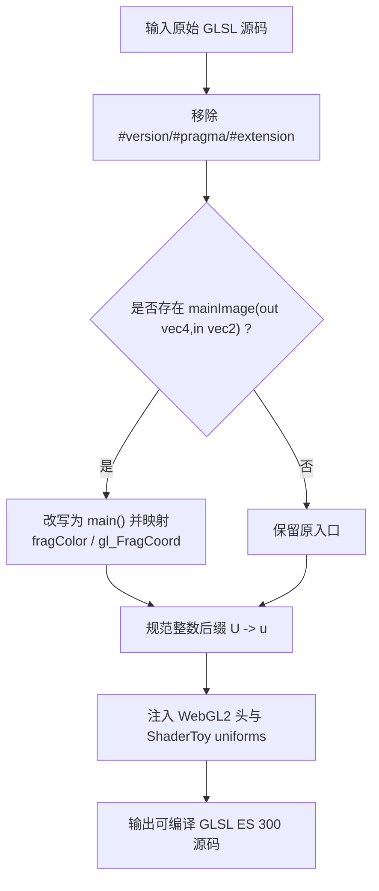
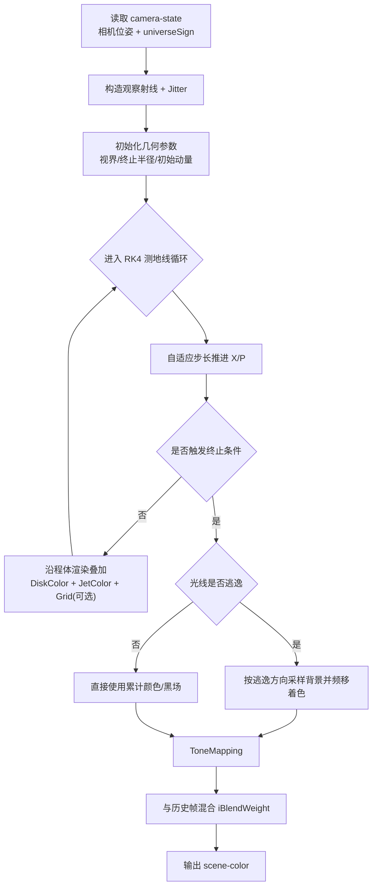
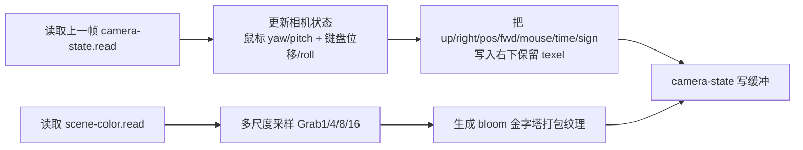

# 02. 算法与 Argo 说明

注：你提到的 `argo` 这里按“算法流程（algorithm flow）”解释。

## 1. Shader 预处理算法（JS 侧）

位置：`src/engine/gl/shaderPreprocess.js`

### 预处理流程图

流程：

1. 文本清洗阶段
   删除所有版本、pragma、extension 行（包括被注释掉的同类标记），避免多源拼接导致编译冲突。
2. 入口适配阶段
   检测 `mainImage(out vec4 X, in vec2 Y)`。
   若存在，替换为：
   `out vec4 fragColor; void main(){ vec2 Y = gl_FragCoord.xy; #define X fragColor ... }`
3. 语法规范阶段
   把 `123U` 改写为 `123u`，匹配 GLSL ES 300 习惯。
4. 头部注入阶段
   拼接 WebGL2 统一头 + ShaderToy uniform 声明。

价值：

1. 减少 shader 作者对 WebGL2 样板代码的关注。
2. 保证模块拼接后只有一个 `#version`，提高可维护性。

## 2. Pass 编排算法（JS 侧）

位置：`src/pipeline/presets/*.js` + `src/app/createRendererApp.js`

核心规则：

1. 每个 pass 定义 `id/targetId/doubleBuffered/channels`。
2. `targetId` 为空表示直出屏幕；否则写入对应 RenderTarget。
3. `channels[i]` 由字符串协议解析：
   `keyboard` -> 键盘纹理
   `<target>.read` -> 对应 RenderTarget 的读纹理

渲染时对每个 pass：

1. 绑定目标 FBO（或默认 FBO）。
2. 设置通用 uniform（时间、分辨率、帧号、鼠标）。
3. 逐槽绑定 `iChannel0..3`。
4. 绘制全屏三角形。
5. 若目标为双缓冲，执行 `swap()`。

## 3. scene-color 主算法（GLSL）

位置：`src/shader/modules/scene-color/*.frag`（由 pass 入口聚合）

### `TraceRay` 主流程图

主流程（`main.frag` 的 `TraceRay`）：

1. 从 `camera-state` 读取相机位置与基向量。
2. 构造观察射线（含时间抖动 Jitter）。
3. 根据黑洞参数（自旋 `iSpin`、电荷 `iQ` 等）计算视界相关半径。
4. 初始化协变动量 `P_cov`，进入自适应步长测地线积分（RK4）。
5. 每步更新：
   `X`（位置/时间）和 `P`（动量）；
   检测终止条件（超边界、入视界、步数上限、能量异常等）。
6. 在路径上做体渲染叠加：
   `DiskColor`（吸积盘） + `JetColor`（喷流） + 可选网格调试。
7. 若光线逃逸，按逃逸方向采样背景（恒星场/特殊背景）。
8. 色调映射后，与历史帧按 `iBlendWeight` 做时域混合。

关键算法点：

1. 自适应步长
   根据几何尺度、力项尺度、当前位置动态调步，平衡性能与稳定性。
2. Hamiltonian 修正
   积分后对动量做守恒约束修正，抑制漂移误差。
3. 双宇宙符号切换
   穿越特定区域时翻转 `universeSign`，支持拓扑切换表现。

## 4. camera-state 算法

位置：`src/shader/modules/camera-state/*.frag`

### camera-state 双职责图

包含两件事：

1. 相机状态更新与打包（底部右侧保留像素）
   读取上一帧的 `up/right/pos/fwd/mouse/time/universeSign`；
   使用鼠标 yaw/pitch、按键 WASD + Q/E + R/F 更新相机；
   再写回固定 texel。
2. Bloom 金字塔采样图生成
   对 `scene-color` 做多尺度抓取（`Grab1/4/8/16`），把多 octave 数据打包到同一纹理布局。

该 pass 等价于“状态存储器 + 预滤波器”。

## 5. Bloom 模糊与合成算法

1. 模糊阶段
   `bloom-blur-horizontal` 与 `bloom-blur-vertical` 复用 5-tap 高斯核；
   两次分离卷积减少采样成本。
2. 合成阶段（`image` pass）
   从场景色取基色；
   从 bloom 纹理按 octave 重建并加权相加；
   再做 tone mapping、对比曲线、伽马调整、saturate。

## 6. 输入编码算法

1. 键盘：`KeyboardTexture`
   `keyCode` 对应纹理 x 坐标，R 通道 255/0 表示按下/抬起。
2. 鼠标：`mouseState`
   记录当前位置 + 按下点；`iMouse.zw` 在按下时表示点击位置。

这样 shader 不依赖 DOM 事件，统一通过纹理/uniform 读取输入。

## 7. 校验算法（脚本）

位置：`scripts/validate-shaders.mjs`

校验项：

1. preset 内 pass id 不重复。
2. channel 必须 4 槽且引用目标存在。
3. manifest pass 声明合法、文件存在。
4. include 无缺失/无循环。
5. 预处理后必须存在 `main()` 且只有一个 `#version`。

该脚本是防止“配置正确但运行时黑屏”的关键前置保障。
