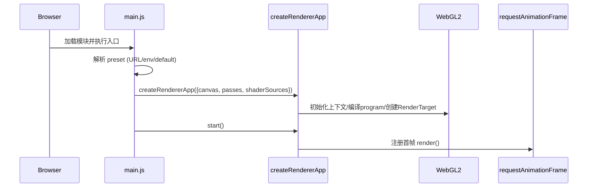
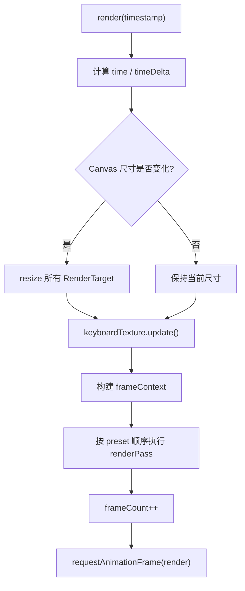
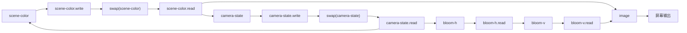

# 03. 执行逻辑与时序

## 1. 启动时序

入口：`src/main.js`

### 启动时序图

1. 获取 `#gl-canvas`。
2. 选择 preset：
   URL `?preset=...` > `VITE_PASS_PRESET` > 默认 `bloom-chain`。
3. 调用 `createRendererApp({ canvas, passes, shaderSources })`。
4. `app.start()` 进入 `requestAnimationFrame` 循环。

## 2. createRendererApp 初始化逻辑

位置：`src/app/createRendererApp.js`

初始化顺序：

1. 创建 `WebGL2RenderingContext`，检查 `EXT_color_buffer_float`。
2. 编译全屏顶点 shader。
3. 创建全屏三角形 buffer。
4. 创建输入系统：
   `KeyboardTexture`、`mouseState`。
5. 遍历所有 shader source：
   编译 fragment shader -> link program -> 缓存 uniform location。
6. 根据 pass 配置抽取唯一 `targetId`，创建 RenderTarget（含双缓冲标记）。
7. 调整 canvas 到设备像素比大小。

## 3. 每帧主循环逻辑

函数：`render(timestamp)`

### 每帧循环图

每帧步骤：

1. 计算 `time`、`timeDelta`。
2. 若 canvas 尺寸变化：
   调 `RenderTarget.resize()` 重建所有离屏纹理/FBO。
3. 调 `keyboardTexture.update()` 把最新按键态写入 GPU。
4. 构建 `frameContext = { time, timeDelta, frameCount }`。
5. 按 preset 顺序执行每个 pass（`passes.forEach(renderPass)`）。
6. `frameCount++`，请求下一帧。

## 4. 单个 pass 执行逻辑

函数：`renderPass(pass, frameContext)`

1. 解析 program 与 uniform 缓存。
2. 若有 `targetId`，绑定写入 FBO；否则绑定屏幕。
3. 设置 viewport 为 canvas 尺寸。
4. 绑定 program 与全屏三角形。
5. 设置共用 uniform：
   `iResolution/iTime/iTimeDelta/iFrame/iMouse`。
6. 依序处理 4 个通道：
   解析 `keyboard` 或 `<target>.read`，绑定到 `TEXTURE0+i`。
7. `gl.drawArrays(TRIANGLES, 0, 3)`。
8. 若该 target 双缓冲，立即 `swap()`。

关键点：

1. `swap()` 在 pass 结束后做，意味着“下一帧/下次读取”看到的是刚写完那一面。
2. 这种设计保证反馈链路稳定，不会读写同一纹理导致未定义行为。

## 5. 默认 preset 的完整数据流

### Pass 执行与交换图

### 5.1 scene-color

输入：

1. `iChannel2 = camera-state.read`（相机状态纹理）
2. `iChannel3 = scene-color.read`（历史颜色）

输出：

1. 写入 `scene-color` 的写缓冲
2. pass 末尾 swap，成为新的 `scene-color.read`

### 5.2 camera-state

输入：

1. `iChannel0 = scene-color.read`（当前场景色，用于 bloom 金字塔采样）
2. `iChannel1 = camera-state.read`（上一帧状态）
3. `iChannel3 = keyboard`（键盘纹理）

输出：

1. 右下保留 texel：相机状态包
2. 其余区域：多尺度 bloom 采样图
3. pass 末尾 swap

### 5.3 bloom blur h/v

输入：

1. h-pass：`camera-state.read`
2. v-pass：`bloom-blur-horizontal.read`

输出：

1. 横向模糊结果 -> 纵向模糊结果

### 5.4 image

输入：

1. `iChannel0 = scene-color.read`
2. `iChannel3 = bloom-blur-vertical.read`

输出：

1. 最终屏幕像素

## 6. 状态持久化逻辑

有三类跨帧状态：

1. `scene-color` 双缓冲
   承担 TAA/历史混合。
2. `camera-state` 双缓冲
   承担相机状态与 universeSign 持久化。
3. JS 侧计数状态
   `frameCount`、`lastTime`、输入缓存。

它们共同保证了“GPU 视觉状态”与“CPU 调度状态”同步演进。

## 7. 异常与降级路径

1. 找不到 canvas：直接抛错，启动失败。
2. 不支持 WebGL2：直接抛错。
3. 不支持 `EXT_color_buffer_float`：
   控制台警告，但仍尝试 `RGBA16F` 路径。
4. shader 编译失败：
   输出处理后源码前 100 行，便于定位 include/宏问题。
5. 无效 preset：
   回退默认 preset 并给出 warning。

## 8. 可维护性要点

1. 新增 pass 时，优先改 `shader.frag` + `pipeline/presets/*.js`，不要在运行时硬编码。
2. 修改 include 结构后先跑 `npm run validate:shaders`。
3. 改通道协议时，需同步 `resolveChannelTexture()` 与校验脚本规则。
